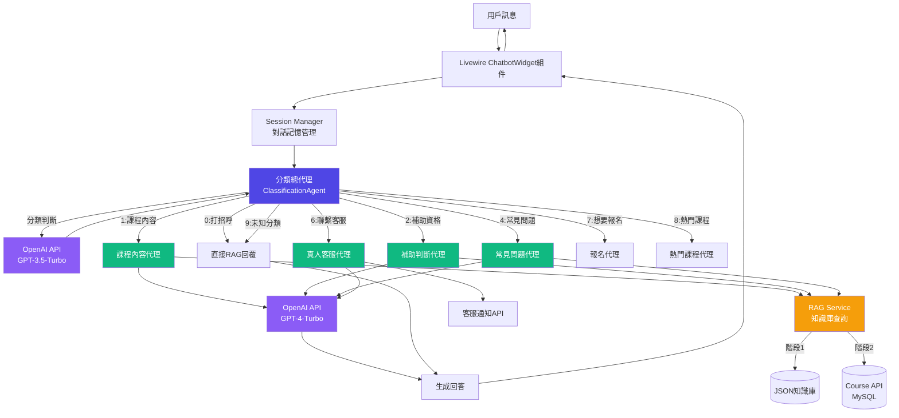
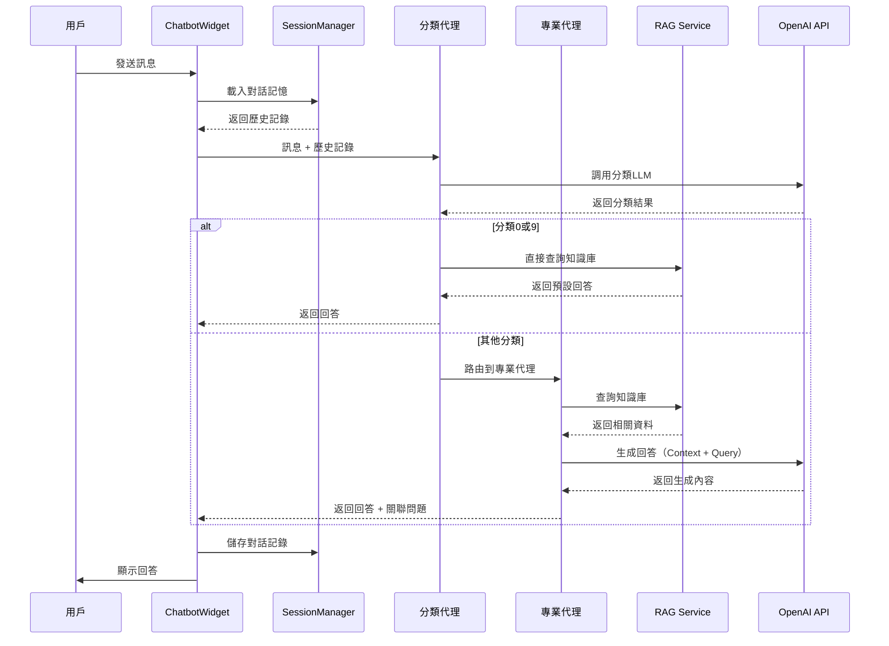

# 虹宇職訓智能客服系統 - 系統架構設計書

**文件版本**: 1.0
**最後更新**: 2025-10-24
**作者**: 虹宇職訓開發團隊

---

## 📋 目錄

1. [專案概述](#專案概述)
2. [技術堆疊](#技術堆疊)
3. [多代理系統架構](#多代理系統架構)
4. [資料流程設計](#資料流程設計)
5. [OpenAI API調用策略](#openai-api調用策略)
6. [對話記憶機制](#對話記憶機制)
7. [錯誤處理與降級策略](#錯誤處理與降級策略)
8. [性能優化策略](#性能優化策略)

---

## 專案概述

### 業務背景

虹宇職訓是桃園地區專業的職業訓練機構，提供政府補助的在職/待業職訓課程。為了提升客戶服務效率，需要打造一個智能客服系統，能夠：

- 自動回答常見問題（課程資訊、補助政策、報名流程等）
- 智能判斷用戶補助資格
- 提供個人化課程推薦
- 必要時轉接真人客服

### 系統目標

1. **提升服務效率**：自動化處理80%的常見問題
2. **降低人力成本**：減少客服人員重複性工作
3. **改善用戶體驗**：24/7即時回應，減少等待時間
4. **數據收集分析**：收集用戶需求數據，優化服務

### 核心功能

- ✅ 彈出式客服視窗（網頁右下角）
- ✅ 多代理智能分類系統（9個分類）
- ✅ 對話記憶功能（上下文理解）
- ✅ 課程資訊查詢（約20門課程）
- ✅ 補助資格智能判斷
- ✅ 真人客服無縫轉接
- ✅ RWD響應式設計（Desktop/Mobile）

---

## 技術堆疊

### 後端框架

| 技術 | 版本 | 用途 |
|------|------|------|
| **Laravel** | 8.x | 主要Web框架 |
| **Livewire** | 2.x | 前後端互動組件 |
| **PHP** | 7.4+ | 伺服器端語言 |

### 前端技術

| 技術 | 版本 | 用途 |
|------|------|------|
| **Tailwind CSS** | 3.x | CSS框架 |
| **Alpine.js** | 3.x | 輕量級JS框架（Livewire內建） |
| **Blade** | - | Laravel模板引擎 |

### AI/ML服務

| 服務 | 模型 | 用途 |
|------|------|------|
| **OpenAI API** | GPT-4-Turbo | 專業代理回答生成 |
| **OpenAI API** | GPT-3.5-Turbo | 分類LLM（成本優化） |

### 資料存儲

| 技術 | 用途 | 階段 |
|------|------|------|
| **JSON文件** | 知識庫存儲 | 階段1：開發初期 |
| **MySQL** | 課程資料API | 階段2：API整合 |
| **Session Storage** | 對話記憶 | 所有階段 |
| **MySQL RAG** | 向量化搜索 | 階段3：延後執行 |

### 開發工具

- **Git** - 版本控制
- **Composer** - PHP依賴管理
- **NPM** - 前端依賴管理

---

## 多代理系統架構

### 系統架構圖



### 代理職責說明

#### 分類總代理 (ClassificationAgent)

**職責**：
- 接收用戶訊息
- 調用OpenAI進行意圖分類（9個分類）
- 管理對話記憶（Session）
- 路由到對應的專業代理
- 處理打招呼/未知分類的直接回覆

**分類定義**：
- **0 - 打招呼**：閒聊、問候、與服務無關
- **1 - 課程內容**：課表、主題、時間、授課方式
- **2 - 補助資格**：補助辦法、資格確認
- **4 - 常見問題**：流程、規定、聯絡方式
- **6 - 聯繫客服**：轉真人、請假、找專人
- **7 - 想要報名**：報名意願、報名方式
- **8 - 熱門課程**：推薦課程、精選課程
- **9 - 未知分類**：無法歸類的問題

#### 課程內容代理 (CourseAgent)

**職責**：
- RAG查詢課程資料（JSON或API）
- 生成課程清單（簡化版）
- 回答單一問題（如：報名截止時間）
- 生成關聯問題選項
- 提供課程網址（完整資訊）

**回答策略**：
- 列出課程清單（顯示關鍵資訊）
- 回答特定問題（從資料提取）
- 不展開完整內容，提供網址

#### 補助判斷代理 (SubsidyAgent)

**職責**：
- 理解用戶身份（在職/待業）
- 執行決策樹邏輯
- RAG查詢補助規則
- 判斷補助比例（100%/80%）
- 生成選項按鈕（避免輸入）

**補助規則**：
- **在職者**：80%補助，需先繳全額後補助
- **待業者**：100%補助（或一般國民(從未加過勞保)自付20%）

#### 常見問題代理 (FAQAgent)

**職責**：
- RAG查詢FAQ資料庫
- 生成關聯問題選項
- 緩存關聯資料（避免重複API調用）
- 找不到答案時友善回覆

#### 真人客服代理 (HumanServiceAgent)

**職責**：
- 理解用戶需求
- 組合客服通知訊息（JSON格式）
- 調用通知API
- 回覆用戶（已通知，請稍候）

#### 報名代理 (EnrollmentAgent)

**職責**：
- 提供報名流程說明
- 引導填寫報名表單
- 提供報名連結

#### 熱門課程代理 (FeaturedAgent)

**職責**：
- 查詢featured=1的課程
- 推薦熱門課程
- 提供課程清單

---

## 資料流程設計

### 兩階段資料策略

#### 階段1：JSON知識庫（開發初期）

**目的**：快速啟動開發，不依賴後端API

```
用戶查詢
   ↓
代理讀取 knowledge_base/*.json
   ↓
解析JSON資料
   ↓
組合回答
```

**優點**：
- ✅ 快速開發，不需要等待API
- ✅ 易於修改和測試
- ✅ 版本控制友善

**缺點**：
- ❌ 資料更新需要重新部署
- ❌ 無法即時同步課程資訊
- ❌ 不適合大量資料

#### 階段2：Course API整合（正式上線）

**目的**：即時同步課程資料，動態更新

```
用戶查詢
   ↓
代理調用 CourseAPIService
   ↓
GET /api/courses
   ↓
MySQL courses表查詢
   ↓
返回JSON資料
   ↓
組合回答
```

**優點**：
- ✅ 即時資料同步
- ✅ 支援動態篩選（featured、type）
- ✅ 易於維護和擴展

**遷移策略**：
- 保持Service層接口一致
- 切換資料來源（JSON → API）
- 不影響前端邏輯

### 對話流程



---

## OpenAI API調用策略

### 模型選擇策略

#### 分類LLM - GPT-3.5-Turbo

**用途**：用戶訊息分類（9個分類）

**理由**：
- ✅ 分類任務較簡單，不需要GPT-4
- ✅ 成本低（$0.0015 / 1K tokens）
- ✅ 速度快，回應時間短

**Prompt結構**：
```
System: 你是專門的對話意圖分類AI
User: [用戶訊息 + 對話歷史]
Output: JSON格式分類結果
```

#### 專業代理LLM - GPT-4-Turbo

**用途**：生成專業回答（課程、補助、FAQ等）

**理由**：
- ✅ 需要高準確度和專業性
- ✅ 複雜邏輯推理（如補助判斷）
- ✅ 自然語言生成品質高

**Prompt結構**：
```
System: [代理角色定義]
Context: [RAG查詢結果]
History: [對話歷史]
User: [用戶問題]
Output: 專業回答 + 關聯問題
```

### 成本優化策略

#### 1. 緩存機制

**常見問題緩存**：
```php
// 緩存常見問題回答（24小時）
$cacheKey = "faq_" . md5($question);
$answer = Cache::remember($cacheKey, 86400, function() {
    return $this->callOpenAI($question);
});
```

#### 2. 關聯問題點擊避免重複調用

```php
// 用戶點擊關聯問題時，直接從緩存的資料提取
if ($clickedRelatedQuestion) {
    // 從Session中提取之前RAG查詢的完整資料
    $data = Session::get('last_rag_data');
    return $this->extractAnswer($data, $question);
}
```

#### 3. Token限制

```php
// 限制Prompt長度，減少token消耗
$maxContextTokens = 1500; // 約1500詞
$truncatedContext = $this->truncateContext($ragData, $maxContextTokens);
```

#### 4. 批次處理

```php
// 課程清單批次處理，一次調用返回多個課程
$courses = $this->getCourses(['type' => 'unemployed']);
$response = $this->generateCourseList($courses); // 一次生成
```

### API錯誤處理

```php
try {
    $response = OpenAI::chat()->create([
        'model' => 'gpt-4-turbo',
        'messages' => $messages,
        'timeout' => 30,
    ]);
} catch (OpenAI\Exceptions\ErrorException $e) {
    // API錯誤降級處理
    return $this->getFallbackResponse();
} catch (Exception $e) {
    // 通用錯誤處理
    Log::error('OpenAI API Error: ' . $e->getMessage());
    return '抱歉，系統暫時無法回應，請稍後再試或聯絡客服。';
}
```

---

## 對話記憶機制

### Session結構設計

```php
// Session資料結構
[
    'session_id' => 'uuid',
    'user_name' => '王小明', // 可選
    'started_at' => '2025-10-24 10:30:00',
    'last_active' => '2025-10-24 10:35:00',

    'history' => [
        [
            'role' => 'user',
            'content' => '我想了解課程補助',
            'timestamp' => '2025-10-24 10:30:00',
        ],
        [
            'role' => 'assistant',
            'content' => '請問您目前是在職工作，還是待業中呢？',
            'category' => '補助資格',
            'timestamp' => '2025-10-24 10:30:05',
        ],
        [
            'role' => 'user',
            'content' => '在職',
            'timestamp' => '2025-10-24 10:30:20',
        ],
    ],

    'context' => [
        'last_category' => '補助資格',
        'last_response' => '請問您目前是在職工作，還是待業中呢？',
        'user_status' => '在職', // 補助判斷時記錄
        'selected_course' => null, // 課程查詢時記錄
        'rag_data' => [...], // 最後一次RAG查詢結果（用於關聯問題）
    ],
]
```

### Session管理類別

```php
// src/main/php/Services/SessionManager.php

class SessionManager
{
    public function __construct()
    {
        if (!session()->has('chatbot_session')) {
            $this->initSession();
        }
    }

    public function initSession()
    {
        session([
            'chatbot_session' => [
                'session_id' => Str::uuid()->toString(),
                'started_at' => now(),
                'last_active' => now(),
                'history' => [],
                'context' => [],
            ]
        ]);
    }

    public function addMessage($role, $content, $metadata = [])
    {
        $session = session('chatbot_session');
        $session['history'][] = array_merge([
            'role' => $role,
            'content' => $content,
            'timestamp' => now()->toDateTimeString(),
        ], $metadata);

        $session['last_active'] = now();
        session(['chatbot_session' => $session]);
    }

    public function getHistory($limit = 10)
    {
        $history = session('chatbot_session.history', []);
        return array_slice($history, -$limit);
    }

    public function setContext($key, $value)
    {
        session(["chatbot_session.context.{$key}" => $value]);
    }

    public function getContext($key, $default = null)
    {
        return session("chatbot_session.context.{$key}", $default);
    }

    public function clearSession()
    {
        session()->forget('chatbot_session');
        $this->initSession();
    }
}
```

### 記憶使用範例

#### 簡短回覆理解

```php
// 用戶輸入："1"
$lastResponse = SessionManager::getContext('last_response');
// "請問想了解AI繪畫課程的 1. 課程時間 還是 2. 課程地點？"

// 分類LLM會基於上下文理解 "1" 指的是 "課程時間"
$prompt = "
last_response: {$lastResponse}
user_message: 1
";
// 分類結果：category=課程內容, search="AI繪畫課程時間"
```

#### 補助判斷狀態保持

```php
// 第一輪：詢問在職/待業
SessionManager::setContext('subsidy_step', 'ask_employment_status');

// 用戶回答："在職"
SessionManager::setContext('user_status', '在職');
SessionManager::setContext('subsidy_step', 'ask_special_status');

// 第二輪：詢問是否符合特殊身份
// 基於之前記錄的 user_status 進行判斷
```

---

## 錯誤處理與降級策略

### 錯誤類型與處理

#### 1. OpenAI API錯誤

**錯誤情境**：
- API超時
- API限流（Rate Limit）
- API服務異常

**降級策略**：
```php
if ($openAIError) {
    // 降級到預設回答
    return $this->getFallbackResponse($category);
}
```

**預設回答範例**：
```
"抱歉，系統暫時無法回應您的問題。

您可以：
1. 稍後再試
2. 撥打客服電話：03-3378075
3. 加入LINE官方帳號：@ouy9482x

造成不便，敬請見諒。"
```

#### 2. RAG查詢失敗

**錯誤情境**：
- JSON文件讀取失敗
- API調用失敗
- 查詢無結果

**降級策略**：
```php
if (empty($ragResults)) {
    return "很抱歉，我暫時找不到相關資訊。請問您可以換個方式描述您的問題嗎？或者直接聯絡我們的客服：03-3378075";
}
```

#### 3. Session異常

**錯誤情境**：
- Session過期
- Session資料損壞

**降級策略**：
```php
if (!SessionManager::isValid()) {
    SessionManager::initSession();
    return "抱歉，對話已逾時。讓我們重新開始吧！請問有什麼可以幫您的？";
}
```

### 監控與日誌

```php
// 記錄關鍵操作
Log::channel('chatbot')->info('User Query', [
    'session_id' => $sessionId,
    'category' => $category,
    'query' => $userMessage,
    'response_time' => $responseTime,
]);

// 記錄錯誤
Log::channel('chatbot')->error('OpenAI API Error', [
    'session_id' => $sessionId,
    'error' => $exception->getMessage(),
    'trace' => $exception->getTraceAsString(),
]);
```

---

## 性能優化策略

### 1. 懶加載（Lazy Loading）

```php
// Livewire組件懶加載
<div wire:init="loadMessages">
    @if ($messagesLoaded)
        <!-- 訊息列表 -->
    @else
        <div>載入中...</div>
    @endif
</div>
```

### 2. 資料預載（Eager Loading）

```php
// 預載常用資料
public function mount()
{
    $this->quickOptions = Cache::remember('quick_options', 3600, function() {
        return json_decode(file_get_contents(
            resource_path('config/chatbot/quick_options.json')
        ));
    });
}
```

### 3. 非同步處理

```php
// 複雜查詢使用Queue
dispatch(function() use ($sessionId, $query) {
    $response = $this->complexQuery($query);
    broadcast(new MessageGenerated($sessionId, $response));
});

// 前端顯示載入動畫
```

### 4. CDN加速

```html
<!-- 靜態資源使用CDN -->
<link href="{{ asset('css/chatbot.css') }}" rel="stylesheet">
<script src="{{ asset('js/chatbot.js') }}"></script>
```

---

## 安全性考量

### 1. 輸入驗證

```php
// 限制輸入長度
$this->validate([
    'userInput' => 'required|string|max:500',
]);

// XSS防護
$sanitized = htmlspecialchars($userInput, ENT_QUOTES, 'UTF-8');
```

### 2. API Key保護

```php
// .env 文件
OPENAI_API_KEY=sk-xxxx

// 不要在前端暴露API Key
// 所有API調用都在後端進行
```

### 3. Rate Limiting

```php
// routes/web.php
Route::middleware('throttle:60,1')->group(function() {
    // 每分鐘最多60次請求
    Livewire::component('chatbot-widget', ChatbotWidget::class);
});
```

---

## 附錄

### 相關文件

- [02-knowledge-base-structure.md](./02-knowledge-base-structure.md) - JSON知識庫設計
- [03-agent-implementation.md](./03-agent-implementation.md) - 代理實現規範
- [05-course-api-integration.md](./05-course-api-integration.md) - Course API對接設計

### 參考資料

- Laravel 8 官方文檔：https://laravel.com/docs/8.x
- Livewire 2 官方文檔：https://laravel-livewire.com/docs/2.x
- OpenAI API 文檔：https://platform.openai.com/docs

---

**文件結束**
