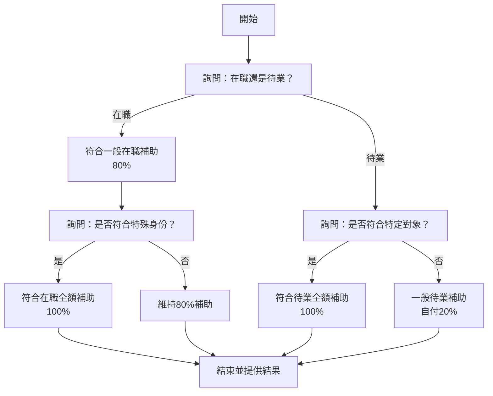

# 虹宇職訓智能客服系統 - 代理實現規範

**文件版本**: 1.0
**最後更新**: 2025-10-24
**作者**: 虹宇職訓開發團隊

---

## 📋 目錄

1. [代理系統概述](#代理系統概述)
2. [分類總代理 (ClassificationAgent)](#分類總代理-classificationagent)
3. [課程內容代理 (CourseAgent)](#課程內容代理-courseagent)
4. [補助判斷代理 (SubsidyAgent)](#補助判斷代理-subsidyagent)
5. [常見問題代理 (FAQAgent)](#常見問題代理-faqagent)
6. [真人客服代理 (HumanServiceAgent)](#真人客服代理-humanserviceagent)
7. [報名代理 (EnrollmentAgent)](#報名代理-enrollmentagent)
8. [熱門課程代理 (FeaturedAgent)](#熱門課程代理-featuredagent)

---

## 代理系統概述

### 代理架構

所有代理繼承自 `BaseAgent` 基礎類別：

```php
// src/main/php/Services/Agents/BaseAgent.php

abstract class BaseAgent
{
    protected $openAIService;
    protected $ragService;
    protected $sessionManager;

    public function __construct(
        OpenAIService $openAIService,
        RAGService $ragService,
        SessionManager $sessionManager
    ) {
        $this->openAIService = $openAIService;
        $this->ragService = $ragService;
        $this->sessionManager = $sessionManager;
    }

    /**
     * 處理用戶訊息（每個代理必須實現）
     */
    abstract public function handle($userMessage, $context = []);

    /**
     * 生成回答
     */
    protected function generateResponse($prompt, $context, $temperature = 0.7)
    {
        $messages = [
            ['role' => 'system', 'content' => $this->getSystemPrompt()],
        ];

        // 加入對話歷史
        $history = $this->sessionManager->getHistory(5);
        foreach ($history as $msg) {
            $messages[] = [
                'role' => $msg['role'],
                'content' => $msg['content']
            ];
        }

        // 加入Context
        if (!empty($context)) {
            $messages[] = [
                'role' => 'system',
                'content' => 'Context: ' . json_encode($context, JSON_UNESCAPED_UNICODE)
            ];
        }

        // 加入用戶訊息
        $messages[] = ['role' => 'user', 'content' => $userMessage];

        return $this->openAIService->chat($messages, $temperature);
    }

    /**
     * 取得系統Prompt（每個代理必須實現）
     */
    abstract protected function getSystemPrompt();
}
```

---

## 分類總代理 (ClassificationAgent)

### 職責

- 接收用戶訊息
- 調用OpenAI進行意圖分類（9個分類）
- 管理對話記憶
- 路由到對應的專業代理
- 處理打招呼（0）/未知分類（9）的直接回覆

### 分類定義

| 編號 | 分類名稱 | 處理方式 |
|------|---------|---------|
| 0 | 打招呼 | 直接RAG回覆 |
| 1 | 課程內容 | CourseAgent |
| 2 | 補助資格 | SubsidyAgent |
| 4 | 常見問題 | FAQAgent |
| 6 | 聯繫客服 | HumanServiceAgent |
| 7 | 想要報名 | EnrollmentAgent |
| 8 | 熱門課程 | FeaturedAgent |
| 9 | 未知分類 | 直接RAG回覆 |

### Prompt設計（基於response.txt）

```php
protected function getSystemPrompt()
{
    return <<<PROMPT
### 角色
你是一個專門的對話意圖分類 AI

### 任務
分析 user_message，以 JSON 格式輸出最符合的意圖。

### 輸出格式
{
  "category": "<分類名稱>",
  "search": "<代表意圖的關鍵詞>"
}

### 判斷與生成規則
1. 首要原則（無意圖/語意不全）：
   - 條件：訊息無明確意圖、語意不完整（如閒聊、問候 "hi", "好的", 或單一詞彙）、與課程、報名、補助等主題無關。
   - 動作：category 設為 "打招呼"，search 設為 "無"。

2. 簡短回覆處理：
   - 條件：訊息僅為數字、"是的"、"都不是"等用於回覆上個問題的內容。
   - 動作：category 和 search 欄位參考 user_history 和 last_response 上下文。

3. "search" 欄位生成規則：
   - 通用：優先還原代名詞（如"那個"、"它"），否則擷取核心關鍵字。
   - 特例（分類"聯繫客服"）：search 格式必須為 "聯繫客服 - (原始事由), (新訊息)"。原始事由可從 user_history 推斷。
   - 特例（簡短回覆）：search 需還原指代內容（如：使用者回 "1"，對應選項是 "課程時間"，search 就填 "課程時間"）。

---
### 分類定義
- 打招呼：閒聊、問候、與服務無關。
- 課程內容：課表、主題、內容、時間、截止日、授課方式。
- 補助資格：想了解補助辦法，以及能否獲得補助。
- 常見問題：特定身份、流程、甄試、考試準備方向、聯絡方式、規定。
- 聯繫客服：轉真人、請假、找專人、線上客服、學員已就業回報。
- 想要報名：我想報名、怎麼報名。
- 熱門課程：熱門、推薦、最多人上的課程。
- 未知分類：不屬於上面任何一個分類。
---

### 核心範例
1. **規則 1（首要原則）**
   user_message: "hi"
   輸出: {"category": "打招呼", "search": "hi"}

2. **規則 2 & 4（簡短回覆）**
   last_response: "請問想了解AI繪畫課程的 1. 課程時間 還是 2. 課程地點？"
   user_message: "1"
   輸出: {"category": "課程內容", "search": "AI繪畫課程時間"}

3. **課程查詢**
   user_message: "有AI相關的課程嗎？"
   輸出: {"category": "課程內容", "search": "AI課程"}

4. **補助查詢**
   user_message: "我想知道補助資格"
   輸出: {"category": "補助資格", "search": "補助資格"}
PROMPT;
}
```

### 實現程式碼

```php
// src/main/php/Services/Agents/ClassificationAgent.php

class ClassificationAgent extends BaseAgent
{
    public function handle($userMessage, $context = [])
    {
        // 準備分類所需的上下文
        $lastResponse = $this->sessionManager->getContext('last_response');
        $history = $this->sessionManager->getHistory(3);

        // 組合Prompt
        $prompt = $this->buildClassificationPrompt($userMessage, $lastResponse, $history);

        // 調用OpenAI分類（使用GPT-3.5-Turbo節省成本）
        $response = $this->openAIService->chat([
            ['role' => 'system', 'content' => $this->getSystemPrompt()],
            ['role' => 'user', 'content' => $prompt]
        ], 0.3, 'gpt-3.5-turbo');

        // 解析分類結果
        $classification = $this->parseClassification($response);

        // 儲存分類結果
        $this->sessionManager->setContext('last_category', $classification['category']);
        $this->sessionManager->setContext('last_search', $classification['search']);

        // 路由到對應代理
        return $this->route($classification['category'], $userMessage, $classification['search']);
    }

    protected function buildClassificationPrompt($userMessage, $lastResponse, $history)
    {
        $historyText = '';
        foreach ($history as $msg) {
            $historyText .= "{$msg['role']}: {$msg['content']}\n";
        }

        return <<<PROMPT
user_message: {$userMessage}
last_response: {$lastResponse}
user_history: {$historyText}
PROMPT;
    }

    protected function parseClassification($response)
    {
        try {
            $data = json_decode($response, true);
            if (!isset($data['category']) || !isset($data['search'])) {
                throw new \Exception('Invalid classification response');
            }
            return $data;
        } catch (\Exception $e) {
            // 降級處理
            return [
                'category' => '未知分類',
                'search' => '無'
            ];
        }
    }

    protected function route($category, $userMessage, $search)
    {
        // 直接RAG回覆（打招呼/未知分類）
        if ($category === '打招呼' || $category === '未知分類') {
            $response = $this->ragService->getDefaultResponse(
                $category === '打招呼' ? 'greeting' : 'unknown',
                $userMessage
            );
            return [
                'content' => $response['response'],
                'quick_options' => $response['quick_options'] ?? []
            ];
        }

        // 路由到專業代理
        $agentMap = [
            '課程內容' => CourseAgent::class,
            '補助資格' => SubsidyAgent::class,
            '常見問題' => FAQAgent::class,
            '聯繫客服' => HumanServiceAgent::class,
            '想要報名' => EnrollmentAgent::class,
            '熱門課程' => FeaturedAgent::class,
        ];

        $agentClass = $agentMap[$category] ?? null;

        if ($agentClass) {
            $agent = app($agentClass);
            return $agent->handle($userMessage, ['search' => $search]);
        }

        // 找不到對應代理，返回未知回覆
        return $this->ragService->getDefaultResponse('unknown');
    }
}
```

---

## 課程內容代理 (CourseAgent)

### 職責

- RAG查詢課程資料（JSON或API）
- 生成課程清單（簡化版）
- 回答單一問題（如：報名截止時間）
- 生成關聯問題選項
- 提供課程網址（完整資訊）

### 回答策略

1. **列出課程清單**：顯示關鍵資訊（開課日期、報名截止、補助）
2. **回答特定問題**：從資料提取對應欄位
3. **不展開完整內容**：提供課程網址

### Prompt設計（基於response.txt）

```php
protected function getSystemPrompt()
{
    return <<<PROMPT
你是「虹宇桃園職訓」的真人客服，專責回覆潛在學員有關政府補助的職訓課程相關問題。請保持禮貌、專業、簡潔清楚的回應語氣。
所有回覆內容都必須嚴格根據 Context 提供的資訊作答，如果用戶訊息為數字，則根據上次客服回覆內容來進行進一步回答。

⚠️ 輸出要求
1. 句子開頭加上表情符號，增加親切感，比如：📚🎓
2. 不要使用 ** 或 ### 來顯示，轉用標點符號，例如：1. 第一點 2. 第二點

⚠️ 補充規則：
- 回覆一律使用「繁體中文」。
- 不可主動生成未在 Context 中提及的課程或資訊。
- 不回答任何與娛樂、心理諮詢、技術開發、個人建議等無關問題。
- 如提供課程內容，請連帶提供參考網頁的網址。
- 如提供課程列表，請連帶提供方便輸入的課程編號，若同時提供待業與在職課程，數字請勿重複。
- 如使用者輸入純數字（例如：1、2、3...），請視為選擇上一輪回覆中列出的課程選單，並依照對應課程項目進行介紹與說明。對應課程項目請從記憶中提取。
- 只回答桃園的課程，若問其他地區則回覆沒有提供。
- 絕對不要憑空生成課程網址，除非上下文有提供。
- 如需提供網址，請將之前的文字空格後再顯示網址，並在網址之後再空一格，不要以Markdown語法呈現。
- 在職與待業這兩個概念相反，不能混用。
- 對於課程的詳細完整內容，不要在對話中展開說明，而是提供課程網址讓用戶查看。
- 可以回答課程的單一問題，例如：報名截止時間、上課地點、課程費用等，但不要一次提供所有資訊。

### 網址提供範例
這是課程網址 https://www.hongyu.goblinlab.org/courses/6 ，請參考

### 課程列表範例
以下是職訓課程列表：
#### 桃園待業課程
1. AI自媒體繪圖影音行銷企劃班
   📅 開課：2025/11/28
   ⏰ 報名截止：2025/11/18 17:30

#### 桃園在職課程
2. PMP專案管理實務班
   📅 開課：2025/12/28
   ⏰ 報名期間：2025/11/28 12:00 ~ 2025/12/25 18:00

### 單一問題回答範例
用戶：1號課程什麼時候報名截止？
回答：📅 AI自媒體繪圖影音行銷企劃班的報名截止時間是 2025/11/18 17:30。

想了解更多？請參考完整課程資訊 https://www.hongyu.goblinlab.org/courses/6
PROMPT;
}
```

### 實現程式碼

```php
// src/main/php/Services/Agents/CourseAgent.php

class CourseAgent extends BaseAgent
{
    public function handle($userMessage, $context = [])
    {
        $search = $context['search'] ?? '';

        // 判斷是否為課程編號選擇
        if (preg_match('/^\d+$/', trim($userMessage))) {
            return $this->handleCourseSelection($userMessage);
        }

        // 判斷查詢類型
        $queryType = $this->determineQueryType($search, $userMessage);

        switch ($queryType) {
            case 'list_unemployed':
                return $this->listCourses('unemployed');

            case 'list_employed':
                return $this->listCourses('employed');

            case 'search':
                return $this->searchCourses($search);

            case 'specific_question':
                return $this->answerSpecificQuestion($userMessage, $search);

            default:
                return $this->generalQuery($userMessage, $search);
        }
    }

    protected function listCourses($type)
    {
        // RAG查詢課程
        $courses = $this->ragService->queryCourses(['type' => $type]);

        if (empty($courses)) {
            return [
                'content' => '抱歉，目前沒有符合條件的課程。請稍後再查詢或聯絡客服。',
                'quick_options' => ['聯絡客服']
            ];
        }

        // 組合課程清單Context
        $context = $this->buildCoursesContext($courses);

        // 儲存到Session（供後續編號選擇使用）
        $this->sessionManager->setContext('course_list', $courses);

        // 生成回答
        $prompt = $type === 'unemployed'
            ? "請列出以下桃園待業課程，使用簡潔格式，包含課程編號、名稱、開課日期、報名截止時間"
            : "請列出以下桃園在職課程，使用簡潔格式，包含課程編號、名稱、開課日期、報名期間";

        $response = $this->generateResponse($prompt, $context);

        return [
            'content' => $response,
            'quick_options' => $this->generateCourseQuickOptions($courses)
        ];
    }

    protected function handleCourseSelection($number)
    {
        // 從Session取得課程清單
        $courseList = $this->sessionManager->getContext('course_list', []);

        $selectedCourse = null;
        $index = (int)$number - 1;

        if (isset($courseList[$index])) {
            $selectedCourse = $courseList[$index];
        }

        if (!$selectedCourse) {
            return [
                'content' => '抱歉，找不到對應的課程編號。請重新選擇。',
                'quick_options' => []
            ];
        }

        // 儲存選中的課程
        $this->sessionManager->setContext('selected_course', $selectedCourse);

        // 組合簡要資訊
        $content = $this->buildCourseSimpleInfo($selectedCourse);

        return [
            'content' => $content,
            'quick_options' => $selectedCourse['related_questions']
        ];
    }

    protected function answerSpecificQuestion($userMessage, $search)
    {
        // 取得當前選中的課程
        $selectedCourse = $this->sessionManager->getContext('selected_course');

        if (!$selectedCourse) {
            // 嘗試搜尋課程
            $courses = $this->ragService->queryCourses(['keyword' => $search]);
            if (!empty($courses)) {
                $selectedCourse = $courses[0];
            }
        }

        if (!$selectedCourse) {
            return [
                'content' => '請先選擇一門課程，或告訴我您想了解哪門課程。',
                'quick_options' => ['查看待業課程', '查看在職課程']
            ];
        }

        // 組合課程資料作為Context
        $context = $selectedCourse;

        // 生成回答
        $prompt = "用戶問題：{$userMessage}\n請根據課程資料回答用戶的特定問題，只回答問題相關的內容，不要展開所有資訊。最後提供課程網址。";

        $response = $this->generateResponse($prompt, $context);

        return [
            'content' => $response,
            'quick_options' => array_diff($selectedCourse['related_questions'], [$search])
        ];
    }

    protected function searchCourses($keyword)
    {
        $courses = $this->ragService->queryCourses(['keyword' => $keyword]);

        if (empty($courses)) {
            return [
                'content' => "很抱歉，找不到關於「{$keyword}」的課程。\n\n您可以：\n1. 換個關鍵字搜尋\n2. 查看所有課程列表\n3. 聯絡客服詢問",
                'quick_options' => ['待業課程', '在職課程', '聯絡客服']
            ];
        }

        // 組合Context
        $context = $this->buildCoursesContext($courses);
        $this->sessionManager->setContext('course_list', $courses);

        $prompt = "請列出以下符合「{$keyword}」的課程，簡潔呈現關鍵資訊";

        $response = $this->generateResponse($prompt, $context);

        return [
            'content' => $response,
            'quick_options' => $this->generateCourseQuickOptions($courses)
        ];
    }

    protected function buildCoursesContext($courses)
    {
        $context = [];
        foreach ($courses as $course) {
            $context[] = [
                'id' => $course['id'],
                'name' => $course['course_name'],
                'full_name' => $course['full_name'],
                'type' => $course['type'],
                'schedule' => $course['schedule'],
                'fee' => $course['fee'],
                'content' => $course['content'],
                'url' => $course['url']
            ];
        }
        return $context;
    }

    protected function buildCourseSimpleInfo($course)
    {
        $typeName = $course['type'] === 'unemployed' ? '待業' : '在職';

        $info = "📚 {$course['course_name']}\n\n";
        $info .= "類型：{$typeName}課程\n";
        $info .= "📅 開課日期：{$course['schedule']['start_date']}\n";

        if (isset($course['schedule']['enrollment_deadline'])) {
            $info .= "⏰ 報名截止：{$course['schedule']['enrollment_deadline']}\n";
        }

        $info .= "💰 費用：{$course['fee']['amount']}\n";
        $info .= "📍 地點：{$course['location']['address']}\n\n";
        $info .= "完整課程資訊請參考 {$course['url']}";

        return $info;
    }

    protected function generateCourseQuickOptions($courses)
    {
        $options = [];
        $count = 1;
        foreach (array_slice($courses, 0, 3) as $course) {
            $options[] = "{$count}號課程詳細資訊";
            $count++;
        }
        $options[] = "查看更多課程";
        return $options;
    }

    protected function determineQueryType($search, $userMessage)
    {
        if (stripos($search, '待業') !== false || stripos($userMessage, '待業') !== false) {
            return 'list_unemployed';
        }

        if (stripos($search, '在職') !== false || stripos($userMessage, '在職') !== false) {
            return 'list_employed';
        }

        // 判斷是否為特定問題
        $specificQuestions = ['時間', '地點', '費用', '報名', '截止', '補助'];
        foreach ($specificQuestions as $q) {
            if (stripos($userMessage, $q) !== false) {
                return 'specific_question';
            }
        }

        return 'search';
    }
}
```

---

## 補助判斷代理 (SubsidyAgent)

### 職責

- 理解用戶身份（在職/待業）
- 執行決策樹邏輯
- RAG查詢補助規則
- 判斷補助比例（100%/80%）
- 生成選項按鈕（避免輸入）

### 決策樹邏輯



### Prompt設計（基於response.txt）

```php
protected function getSystemPrompt()
{
    return <<<PROMPT
### AI 角色
你是一位專業、謹慎且親切的「課程補助資格審核 AI 助理」。你的唯一任務是嚴格根據下方提供的「核心判斷規則」，透過對話來判斷其補助資格。你必須基於規則回答，不可添加規則外資訊。用戶如果提供年次（例如84年次），除非提供4位數西元年（例如1998年），否則意指為民國年（例如：民國114年為2025年），今年為2025年。

### 輸出要求
請避免使用Markdown語法，如 * # -，多用標點符號代替，例如：
1. 低收入戶或中低收入戶中有工作能力者
2. 原住民

句子開頭加上表情符號，增加親切感，比如：💰📋

---
### 核心判斷規則
你必須先詢問對方是在職者，還是失業者的身份，再嚴格依循以下資格進行判斷。

#### 在職者
資格一：部分補助（80%課程費用補助）
1. 年齡限制：年滿15歲以上。
2. 在職與保險身份：必須在「課程開訓當日」為在職勞工，且具備下列任一種保險身份：就業保險、勞工保險、勞工職業災害保險、農民健康保險。

資格二：全額補助（100%課程費用補助）
使用者必須先滿足所有「資格一」的條件，然後再符合下列至少一項身份：
- 低收入戶或中低收入戶中有工作能力者
- 原住民
- 身心障礙者
- 中高齡者（指年滿45歲至65歲）
- 逾65歲之高齡者
- 獨力負擔家計者
- 家庭暴力被害人
- 更生受保護人
- 因犯罪行為被害之特定關係人
- 其他依《就業服務法》第24條規定經中央主管機關認為有必要者

#### 失業或待業者
資格一：全額補助（100%課程費用補助）
使用者必須完全滿足以下任一條件：
1. 就業保險被保險人失業者（含自願與非自願離職）
2. 符合《就業服務法》第24條第1項所列之特定對象失業者，包含：獨力負擔家計者、中高齡者、身心障礙者、原住民、低收入戶或中低收入戶、長期失業者、二度就業婦女、家庭暴力被害人、更生受保護人等
3. 其他弱勢對象失業者（如新住民、性侵害被害人、逾65歲高齡者等）

資格二：部分補助（學員自付20%）
任何不符合上述「資格一」全額補助條件之失業者。

---
### 執行流程與邏輯
請嚴格遵循此流程，不可跳躍或省略。

1. 開啟對話：
   以友善的問候開始，並提出起始問題，判斷使用者是否為「在職勞工」。
   範例：「您好！我是課程補助資格審核助理。為了幫您確認補助資格，請問您目前是在職工作，還是待業中呢？」

2. 資訊探詢與判斷（決策樹）：根據核心判斷原則來進行提問與判斷

3. 完成判斷與回應（提供最終結果）：
   一旦資訊足以做出明確判斷，必須立即停止提問，並從下列回應模板中選擇最適合的一個來回答。

---
### 最終回應模板

## 1. 完全符合資格（100%補助）
恭喜！您完全符合資格，可享有 100% 訓練課程學費補助。
申請時請務必備妥相關證明文件（如：中低收入戶證明、身心障礙證明等），並以開課單位的最終要求為準。

## 2. 部分符合資格（在職者80%補助）
根據您提供的資訊，您符合在職者部分補助資格，可享有 80% 訓練課程學費補助。
此補助需要您先自費繳交全額學費，待課程順利結訓後，才能申請補助款項。資格認定是以「開訓日」當天的投保狀態為準。

## 3. 部分符合資格（待業者80%補助）
根據您提供的資訊，您符合待業者部分補助資格，需自行負擔 20% 的訓練費用。
這適用於不符合全額補助條件的一般失業者。建議您在報名前，向訓練單位確認詳細的費用與申請流程。

## 4. 不確定是否符合補助資格
根據您提供的資訊，無法確認是否符合此項訓練補助方案。建議您與真人客服諮詢。或洽詢 03-3378075（李小姐、陳小姐）
PROMPT;
}
```

### 實現程式碼

```php
// src/main/php/Services/Agents/SubsidyAgent.php

class SubsidyAgent extends BaseAgent
{
    public function handle($userMessage, $context = [])
    {
        // 取得補助判斷進度
        $step = $this->sessionManager->getContext('subsidy_step', 'start');

        switch ($step) {
            case 'start':
                return $this->askEmploymentStatus();

            case 'employed':
                return $this->handleEmployedSubsidy($userMessage);

            case 'unemployed':
                return $this->handleUnemployedSubsidy($userMessage);

            default:
                return $this->continueJudgment($userMessage, $step);
        }
    }

    protected function askEmploymentStatus()
    {
        $this->sessionManager->setContext('subsidy_step', 'ask_employment');

        return [
            'content' => '💰 您好！我是課程補助資格審核助理。\n\n為了幫您確認補助資格，請問您目前是在職工作，還是待業中呢？',
            'quick_options' => ['在職工作', '待業中', '不確定']
        ];
    }

    protected function handleEmployedSubsidy($userMessage)
    {
        $step = $this->sessionManager->getContext('subsidy_step');

        if ($step === 'ask_employment') {
            // 判斷用戶回答
            if ($this->matchKeyword($userMessage, ['在職', '工作'])) {
                $this->sessionManager->setContext('user_status', 'employed');
                $this->sessionManager->setContext('subsidy_step', 'employed_basic');

                // RAG查詢在職補助規則
                $rules = $this->ragService->getSubsidyRules('employed');
                $this->sessionManager->setContext('subsidy_rules', $rules);

                return [
                    'content' => '📋 了解！您目前是在職者。\n\n請問您是否年滿15歲，且在課程開訓當日會有勞保、就保、或農保的投保身份呢？',
                    'quick_options' => ['是的', '不確定', '請說明詳細']
                ];
            }

            if ($this->matchKeyword($userMessage, ['待業', '失業', '沒工作'])) {
                $this->sessionManager->setContext('user_status', 'unemployed');
                $this->sessionManager->setContext('subsidy_step', 'unemployed');
                return $this->handleUnemployedSubsidy($userMessage);
            }
        }

        if ($step === 'employed_basic') {
            // 確認基本資格
            if ($this->matchKeyword($userMessage, ['是', '有', '符合'])) {
                $this->sessionManager->setContext('subsidy_step', 'employed_special');

                return [
                    'content' => '✅ 很好！您已符合在職者80%補助資格。\n\n接下來想確認，您是否符合以下任一特殊身份（可享100%全額補助）：\n\n1. 低收入戶或中低收入戶\n2. 原住民\n3. 身心障礙者\n4. 中高齡者（45-65歲）\n5. 逾65歲高齡者\n6. 獨力負擔家計者\n7. 其他特定身份',
                    'quick_options' => ['符合其中一項', '都不符合', '不確定']
                ];
            }
        }

        if ($step === 'employed_special') {
            if ($this->matchKeyword($userMessage, ['符合', '是', '有'])) {
                return $this->generateResult('employed_100');
            }

            if ($this->matchKeyword($userMessage, ['不符合', '都不', '沒有'])) {
                return $this->generateResult('employed_80');
            }
        }

        // 使用LLM進行對話式判斷
        return $this->generateSubsidyResponse($userMessage);
    }

    protected function handleUnemployedSubsidy($userMessage)
    {
        $step = $this->sessionManager->getContext('subsidy_step');

        if ($step === 'ask_employment' || $step === 'unemployed') {
            $this->sessionManager->setContext('user_status', 'unemployed');
            $this->sessionManager->setContext('subsidy_step', 'unemployed_check');

            // RAG查詢待業補助規則
            $rules = $this->ragService->getSubsidyRules('unemployed');
            $this->sessionManager->setContext('subsidy_rules', $rules);

            return [
                'content' => '📋 了解！您目前是待業者。\n\n請問您是否符合以下任一條件：\n\n1. 有就業保險（失業中）\n2. 屬於特定對象（如：低收入戶、原住民、身心障礙、中高齡、長期失業等）\n3. 弱勢對象（如：新住民、高齡者）',
                'quick_options' => ['符合其中一項', '都不符合', '不確定']
            ];
        }

        if ($step === 'unemployed_check') {
            if ($this->matchKeyword($userMessage, ['符合', '是', '有'])) {
                return $this->generateResult('unemployed_100');
            }

            if ($this->matchKeyword($userMessage, ['不符合', '都不', '沒有'])) {
                return $this->generateResult('unemployed_80');
            }
        }

        // 使用LLM進行對話式判斷
        return $this->generateSubsidyResponse($userMessage);
    }

    protected function generateResult($type)
    {
        $results = [
            'employed_100' => [
                'content' => '🎉 恭喜！您完全符合資格，可享有 100% 訓練課程學費補助。\n\n申請時請務必備妥相關證明文件（如：中低收入戶證明、身心障礙證明等），並以開課單位的最終要求為準。',
                'quick_options' => ['需要什麼文件', '如何申請', '查看課程']
            ],
            'employed_80' => [
                'content' => '✅ 根據您提供的資訊，您符合在職者部分補助資格，可享有 80% 訓練課程學費補助。\n\n此補助需要您先自費繳交全額學費，待課程順利結訓後，才能申請補助款項。資格認定是以「開訓日」當天的投保狀態為準。',
                'quick_options' => ['何時撥款', '申請流程', '查看在職課程']
            ],
            'unemployed_100' => [
                'content' => '🎉 恭喜！您完全符合資格，可享有 100% 訓練課程學費補助。\n\n申請時請務必備妥相關證明文件，並以開課單位的最終要求為準。',
                'quick_options' => ['需要什麼文件', '如何申請', '查看待業課程']
            ],
            'unemployed_80' => [
                'content' => '📋 根據您提供的資訊，您符合待業者部分補助資格，需自行負擔 20% 的訓練費用。\n\n這適用於不符合全額補助條件的一般失業者。建議您在報名前，向訓練單位確認詳細的費用與申請流程。',
                'quick_options' => ['申請流程', '查看待業課程', '聯絡客服']
            ],
        ];

        // 清除補助判斷流程
        $this->sessionManager->setContext('subsidy_step', 'completed');

        return $results[$type];
    }

    protected function generateSubsidyResponse($userMessage)
    {
        $rules = $this->sessionManager->getContext('subsidy_rules');
        $userStatus = $this->sessionManager->getContext('user_status');

        $response = $this->generateResponse($userMessage, $rules);

        return [
            'content' => $response,
            'quick_options' => []
        ];
    }

    protected function matchKeyword($text, $keywords)
    {
        foreach ($keywords as $keyword) {
            if (stripos($text, $keyword) !== false) {
                return true;
            }
        }
        return false;
    }
}
```

---

## 常見問題代理 (FAQAgent)

### 職責

- RAG查詢FAQ資料庫
- 生成關聯問題選項
- 緩存關聯資料（避免重複API調用）
- 找不到答案時友善回覆

### Prompt設計（基於response.txt）

```php
protected function getSystemPrompt()
{
    return <<<PROMPT
### 角色
你是「桃園職訓」的真人客服，專責回覆潛在學員有關課程介紹、報名流程、學費資訊、上課時間、師資介紹等職訓相關問題。請保持禮貌、專業、簡潔清楚的回應語氣。

### 回覆說明
所有回覆內容都必須嚴格根據 Context 提供的資訊作答，並參考對話歷史來精準回答客戶的問題，如果詢問報名流程，務必一次性提供所有步驟，不可以只提供單一步驟，絕對不可自行編造或假設內容。

當使用者的提問在 Context 找不到時，請回覆以下內容：
很抱歉，我僅能協助您關於桃園職訓的常見問題。歡迎您提出任何與職訓相關的疑問！或者與我們的真人客服聯繫。

⚠️ 補充規則：
- 回覆一律使用「繁體中文」。
- 不可主動推薦未在 Context 中提及的課程或資訊。
- 不回答任何與娛樂、心理諮詢、技術開發、個人建議等無關問題。
- 如需請用戶聯絡工作人員，需要提供聯絡方式。
- 句子開頭加上表情符號，增加親切感，比如：❓📝
PROMPT;
}
```

### 實現程式碼

```php
// src/main/php/Services/Agents/FAQAgent.php

class FAQAgent extends BaseAgent
{
    public function handle($userMessage, $context = [])
    {
        $search = $context['search'] ?? '';

        // 檢查是否點擊關聯問題
        $cachedData = $this->sessionManager->getContext('faq_cached_data');
        if ($cachedData && $this->isRelatedQuestion($userMessage, $cachedData)) {
            return $this->answerFromCache($userMessage, $cachedData);
        }

        // RAG搜尋FAQ
        $faqResults = $this->ragService->searchFAQ($search ?: $userMessage);

        if (empty($faqResults)) {
            return [
                'content' => '❓ 很抱歉，我僅能協助您關於桃園職訓的常見問題。歡迎您提出任何與職訓相關的疑問！\n\n或者與我們的真人客服聯繫：\n📞 03-4227723\n💬 LINE: @ouy9482x',
                'quick_options' => ['課程查詢', '補助諮詢', '聯絡客服']
            ];
        }

        // 緩存FAQ資料
        $this->sessionManager->setContext('faq_cached_data', $faqResults);

        // 組合Context
        $context = $this->buildFAQContext($faqResults);

        // 生成回答
        $response = $this->generateResponse($userMessage, $context);

        return [
            'content' => $response,
            'quick_options' => $this->extractRelatedQuestions($faqResults)
        ];
    }

    protected function isRelatedQuestion($userMessage, $cachedData)
    {
        foreach ($cachedData as $faq) {
            if (isset($faq['related_questions'])) {
                foreach ($faq['related_questions'] as $related) {
                    if (stripos($related, $userMessage) !== false ||
                        stripos($userMessage, $related) !== false) {
                        return true;
                    }
                }
            }
        }
        return false;
    }

    protected function answerFromCache($userMessage, $cachedData)
    {
        // 從緩存資料中提取答案，不需要再調用OpenAI
        foreach ($cachedData as $faq) {
            if (stripos($faq['question'], $userMessage) !== false ||
                in_array($userMessage, $faq['related_questions'] ?? [])) {
                return [
                    'content' => '📝 ' . $faq['answer'],
                    'quick_options' => array_diff($faq['related_questions'] ?? [], [$userMessage])
                ];
            }
        }

        // 找不到精確匹配，使用LLM生成
        $context = $this->buildFAQContext($cachedData);
        $response = $this->generateResponse($userMessage, $context);

        return [
            'content' => $response,
            'quick_options' => []
        ];
    }

    protected function buildFAQContext($faqResults)
    {
        $context = [];
        foreach ($faqResults as $faq) {
            $context[] = [
                'question' => $faq['question'],
                'answer' => $faq['answer'],
                'category' => $faq['category']
            ];
        }
        return $context;
    }

    protected function extractRelatedQuestions($faqResults)
    {
        $questions = [];
        foreach ($faqResults as $faq) {
            if (isset($faq['related_questions'])) {
                $questions = array_merge($questions, $faq['related_questions']);
            }
        }
        return array_unique(array_slice($questions, 0, 4));
    }
}
```

---

## 真人客服代理 (HumanServiceAgent)

### 職責

- 理解用戶需求
- 組合客服通知訊息（JSON格式）
- 調用通知API
- 回覆用戶（已通知，請稍候）

### Prompt設計（基於response.txt）

```php
protected function getSystemPrompt()
{
    return <<<PROMPT
### 角色
你是一個智慧客服助理，專門在第一線先回應用戶訊息，並將用戶訊息整理成一則清晰、簡潔的內部通知。

### 輸出規則
- 直接將用戶需求重述為一則「客服待處理事項」。
- 保持專業、簡明，方便客服人員快速理解。

### JSON 輸出格式
{
  "message": "<給客服的通知訊息>"
}

### 範例
用戶：「我要請假」
輸出：
{
  "message": "使用者需要協助處理請假事宜。"
}

用戶：「想詢問補助的詳細文件」
輸出：
{
  "message": "使用者想了解補助申請需要準備的詳細文件。"
}
PROMPT;
}
```

### 實現程式碼

```php
// src/main/php/Services/Agents/HumanServiceAgent.php

class HumanServiceAgent extends BaseAgent
{
    public function handle($userMessage, $context = [])
    {
        // 組合通知訊息
        $notification = $this->generateNotification($userMessage);

        // 調用通知API
        $this->notifyCustomerService($notification);

        // 取得用戶名稱（如有）
        $userName = $this->sessionManager->getContext('user_name', '');

        // 組合回覆
        $response = $userName
            ? "沒問題，{$userName}，我們已經幫您聯繫專屬客服人員了，請稍候，感謝您的耐心！"
            : "沒問題，我們已經幫您聯繫專屬客服人員了，請稍候，感謝您的耐心！";

        return [
            'content' => '📞 ' . $response,
            'quick_options' => []
        ];
    }

    protected function generateNotification($userMessage)
    {
        $history = $this->sessionManager->getHistory(3);
        $lastResponse = $this->sessionManager->getContext('last_response');

        $prompt = <<<PROMPT
last_response: {$lastResponse}
user_history: {$this->formatHistory($history)}
user_message: {$userMessage}

請將用戶需求整理成一則給客服的通知訊息。
PROMPT;

        $response = $this->openAIService->chat([
            ['role' => 'system', 'content' => $this->getSystemPrompt()],
            ['role' => 'user', 'content' => $prompt]
        ], 0.3, 'gpt-3.5-turbo');

        try {
            $data = json_decode($response, true);
            return $data['message'] ?? $userMessage;
        } catch (\Exception $e) {
            return $userMessage;
        }
    }

    protected function notifyCustomerService($message)
    {
        $sessionId = $this->sessionManager->getContext('session_id');
        $userName = $this->sessionManager->getContext('user_name', '訪客');

        // 調用通知API（實際實現依需求）
        // 例如：發送到Slack、Email、或內部系統
        Http::post(config('chatbot.notification_api'), [
            'session_id' => $sessionId,
            'user_name' => $userName,
            'message' => $message,
            'timestamp' => now()->toDateTimeString()
        ]);

        // 記錄日誌
        Log::channel('chatbot')->info('Human Service Requested', [
            'session_id' => $sessionId,
            'message' => $message
        ]);
    }

    protected function formatHistory($history)
    {
        $formatted = '';
        foreach ($history as $msg) {
            $formatted .= "{$msg['role']}: {$msg['content']}\n";
        }
        return $formatted;
    }
}
```

---

## 報名代理 (EnrollmentAgent)

### 職責

- 提供報名流程說明（在職/待業不同）
- 引導填寫報名表單
- 提供報名連結

### 實現程式碼（簡化版）

```php
// src/main/php/Services/Agents/EnrollmentAgent.php

class EnrollmentAgent extends BaseAgent
{
    public function handle($userMessage, $context = [])
    {
        // RAG查詢報名流程
        $processData = $this->ragService->loadJSON('faq/enrollment_process.json');

        // 判斷用戶身份
        $userStatus = $this->sessionManager->getContext('user_status');

        if (!$userStatus) {
            return [
                'content' => '📝 您好！我來協助您了解報名流程。\n\n請問您是要報名「在職課程」還是「待業課程」呢？',
                'quick_options' => ['在職課程', '待業課程', '不確定']
            ];
        }

        // 組合對應的報名流程
        $process = $userStatus === 'employed'
            ? $processData['employed_process']
            : $processData['unemployed_process'];

        $content = $this->formatEnrollmentProcess($process);

        return [
            'content' => $content,
            'quick_options' => ['查看課程', '補助資格', '聯絡客服']
        ];
    }

    protected function formatEnrollmentProcess($process)
    {
        $content = "📝 {$process['title']}\n\n";

        foreach ($process['steps'] as $step) {
            $content .= "{$step['step']}. {$step['title']}\n";
            $content .= "   {$step['description']}\n";

            if (isset($step['documents'])) {
                $content .= "   需準備：" . implode('、', $step['documents']) . "\n";
            }

            if (isset($step['note'])) {
                $content .= "   ⚠️ {$step['note']}\n";
            }

            $content .= "\n";
        }

        $content .= "如有任何問題，歡迎隨時詢問！";

        return $content;
    }

    protected function getSystemPrompt()
    {
        return '你是報名流程助理，請簡潔清楚地說明報名流程，並友善地回答用戶問題。';
    }
}
```

---

## 熱門課程代理 (FeaturedAgent)

### 職責

- 查詢featured=1的課程
- 推薦熱門課程
- 提供課程清單

### 實現程式碼（簡化版）

```php
// src/main/php/Services/Agents/FeaturedAgent.php

class FeaturedAgent extends BaseAgent
{
    public function handle($userMessage, $context = [])
    {
        // RAG查詢精選課程
        $featuredCourses = $this->ragService->queryCourses(['featured' => true]);

        if (empty($featuredCourses)) {
            return [
                'content' => '目前暫無精選課程，請查看所有課程列表。',
                'quick_options' => ['待業課程', '在職課程']
            ];
        }

        // 組合Context
        $context = $this->buildCoursesContext($featuredCourses);
        $this->sessionManager->setContext('course_list', $featuredCourses);

        // 生成回答
        $prompt = "請列出以下熱門精選課程，使用吸引人的方式呈現，包含課程亮點";

        $response = $this->generateResponse($prompt, $context);

        return [
            'content' => $response,
            'quick_options' => $this->generateCourseQuickOptions($featuredCourses)
        ];
    }

    protected function buildCoursesContext($courses)
    {
        // 同CourseAgent的實現
        $context = [];
        foreach ($courses as $course) {
            $context[] = [
                'id' => $course['id'],
                'name' => $course['course_name'],
                'type' => $course['type'],
                'schedule' => $course['schedule'],
                'fee' => $course['fee'],
                'content' => $course['content'],
                'url' => $course['url']
            ];
        }
        return $context;
    }

    protected function generateCourseQuickOptions($courses)
    {
        // 同CourseAgent的實現
        $options = [];
        $count = 1;
        foreach (array_slice($courses, 0, 3) as $course) {
            $options[] = "{$count}號課程詳細資訊";
            $count++;
        }
        return $options;
    }

    protected function getSystemPrompt()
    {
        return '你是課程推薦助理，請以熱情、專業的方式介紹熱門課程，強調課程特色和優勢。';
    }
}
```

---

## 附錄

### 代理測試範例

```php
// tests/Feature/AgentsTest.php

class AgentsTest extends TestCase
{
    public function test_classification_agent()
    {
        $agent = new ClassificationAgent(
            $this->mock(OpenAIService::class),
            $this->mock(RAGService::class),
            $this->mock(SessionManager::class)
        );

        $result = $agent->handle('有AI課程嗎？');

        $this->assertEquals('課程內容', $result['category']);
    }

    // 更多測試...
}
```

### 相關文件

- [01-system-architecture.md](./01-system-architecture.md) - 系統架構設計
- [02-knowledge-base-structure.md](./02-knowledge-base-structure.md) - JSON知識庫設計
- [05-course-api-integration.md](./05-course-api-integration.md) - Course API對接設計

---

**文件結束**
